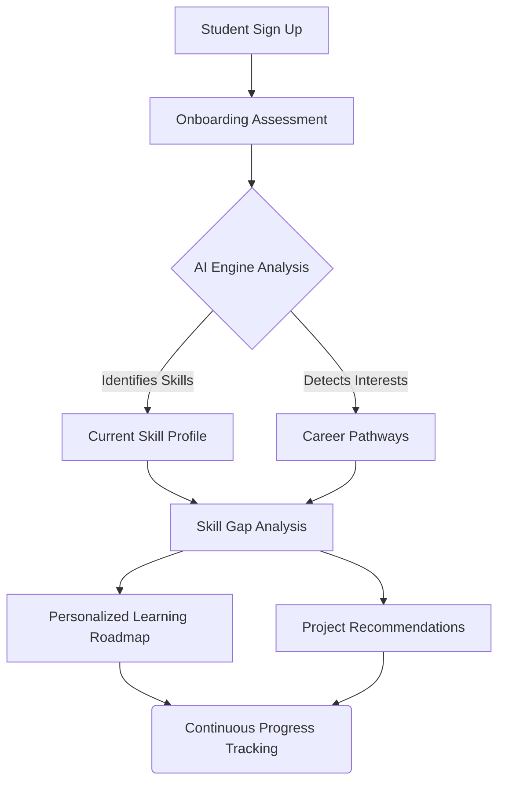
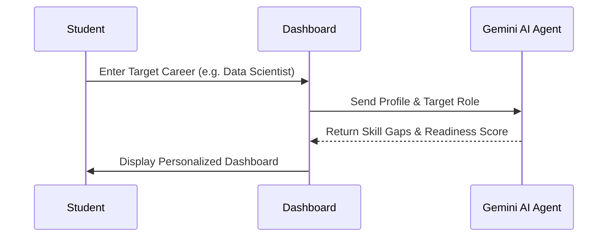

# PathPilot AI

PathPilot AI is an intelligent platform designed to provide students with personalized career guidance and academic support. Leveraging AI, it helps students discover their ideal career paths, plan their academics accordingly, and get tailored recommendations to achieve their goals.

## Workflows & Architecture

Below is the high-level workflow of how a student interacts with the PathPilot platform:

### AI Agent Workflow

## Dashboard Overview

Our dashboard provides a premium, dark-mode experience with all necessary metrics at a glance.

## Features

- **Personalized Dashboard**: View your progress, recommendations, and upcoming tasks.
- **Career Pathways**: Explore different career options and see the skills and education required for each.
- **Academic Planning**: Create a customized academic plan based on your career goals.
- **AI-Powered Recommendations**: Get smart suggestions for courses, internships, and extracurricular activities.

## Setup and Running

1. Clone the repository.
2. Run `npm install` to install dependencies.
3. Run `npm run dev` to start the development server.
